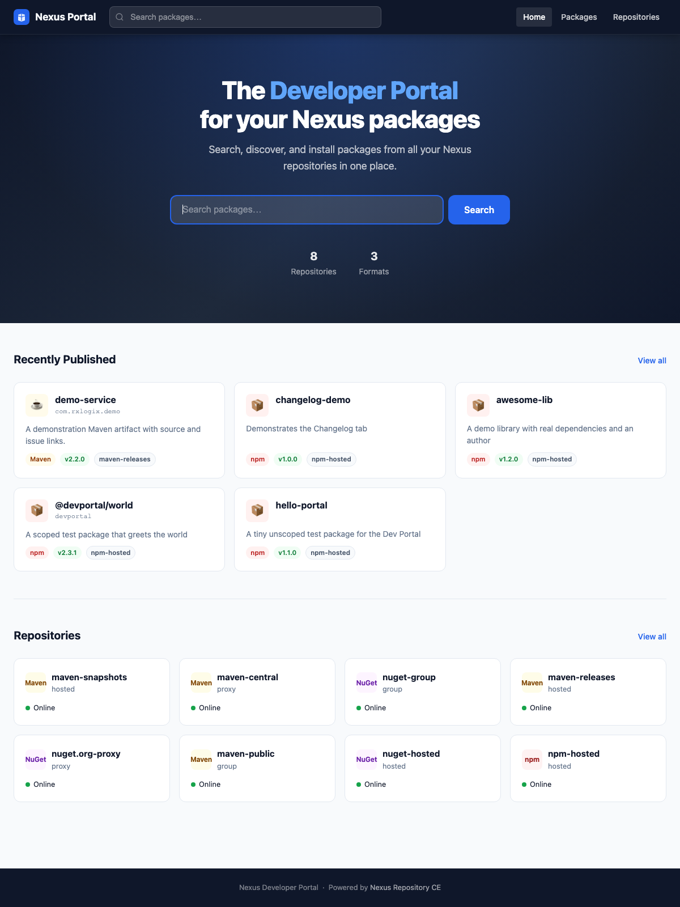
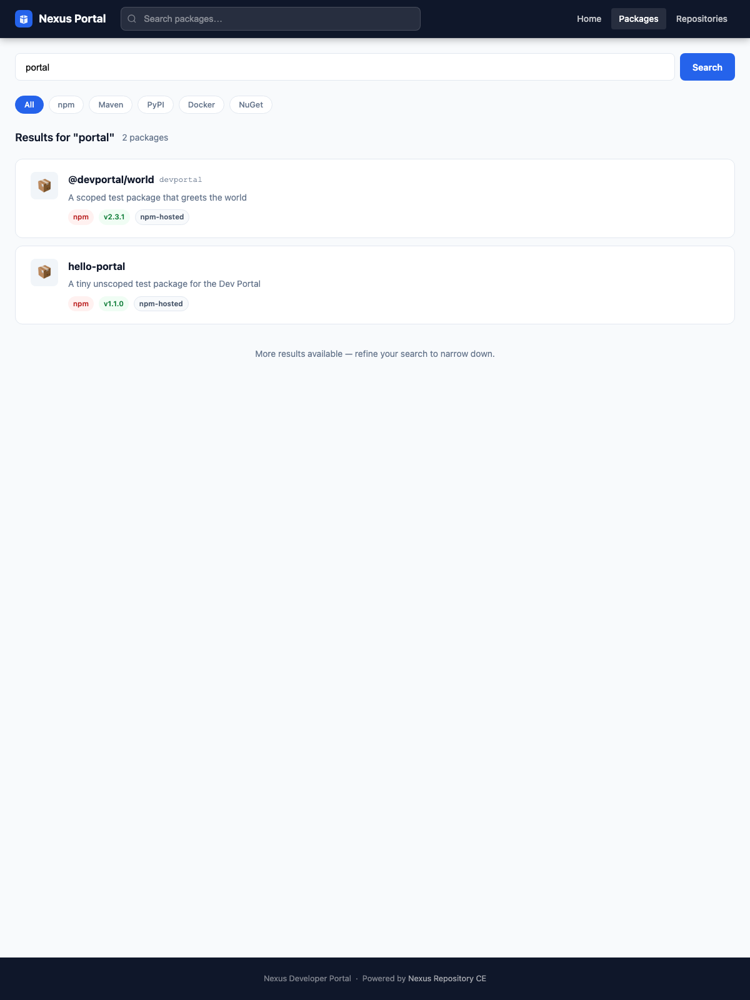
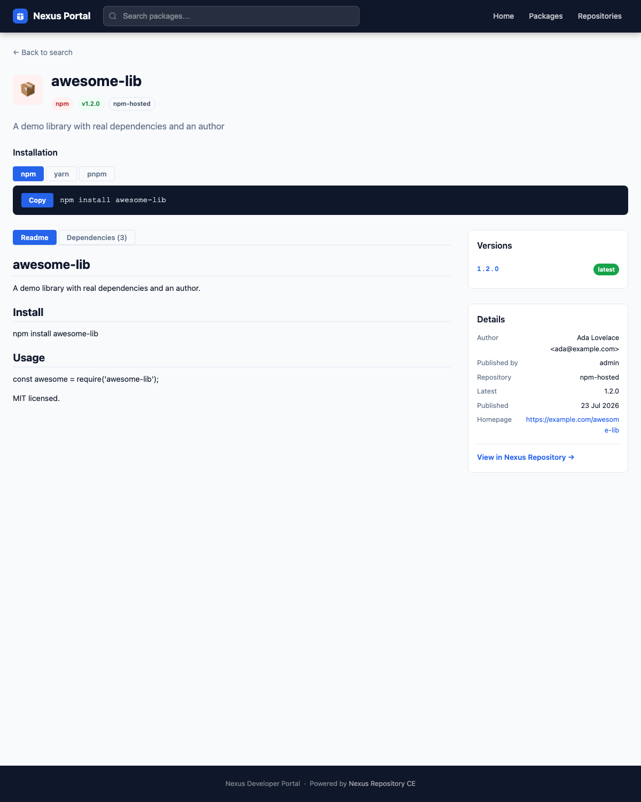
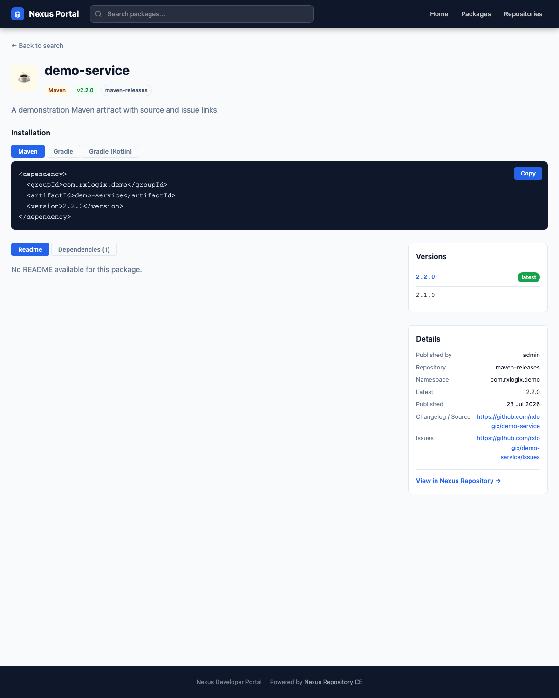

# Nexus Developer Portal

A developer-friendly package portal for **Nexus Repository Community Edition 3.94+** — inspired by Verdaccio, GitHub Packages, and GitLab Package Registry.

> **Single-file deployment.** Copy one `.jar` file into Nexus's `deploy/` directory, restart, done.

---

## What it does

Adds a **developer-facing UI** inside your existing Nexus installation without touching the admin UI or creating any external processes: no Node server, no Docker sidecar, no nginx.

| Feature | Status |
|---------|--------|
| Landing page with search | ✅ Phase 1 — verified on 3.94.0-12 |
| Repository listing with format filters | ✅ Phase 1 — verified on 3.94.0-12 |
| npm search / recent / versions / detail | ✅ verified on 3.94.0-12 |
| Maven search / versions / detail (POM deps) | ✅ verified on 3.94.0-12 |
| Rendered README, multi-tool install snippets, version picker | ✅ verified on 3.94.0-12 |
| Tabbed Readme / Changelog (from tarball) / Dependencies | ✅ verified on 3.94.0-12 |
| Per-repository permission enforcement | ✅ verified on 3.94.0-12 |

---

## Screenshots

| Home | Search |
|------|--------|
|  |  |

| npm package page | Maven package page |
|------------------|--------------------|
|  |  |

> More captures (and how they were produced) in [`docs/screenshots/`](docs/screenshots/).

---

## Access

Once deployed, open:

```
http://<nexus-host>:<port>/service/rest/devportal/ui
```

The REST API lives at:

```
http://<nexus-host>:<port>/service/rest/devportal/api/
```

---

## Compatibility

| Nexus version | Supported |
|---------------|-----------|
| **3.94.0 and later** (Spring Boot 3 fat-JAR architecture) | ✅ |
| 3.93 and earlier (OSGi/Karaf architecture) | ❌ — different plugin model entirely |

The plugin integrates via Spring Boot auto-configuration and direct RESTEasy
registration; see [Architecture.md](Architecture.md) for how (and why) this works.

---

## Deployment

### Requirements

| Requirement | Version |
|-------------|---------|
| Java (build only) | **21+** — Nexus 3.94 classes are compiled for Java 21 |
| Maven | 3.8+ |
| Nexus Repository CE | 3.94+ |

### Step 1 — Install Nexus compile-time dependencies (once per machine)

Nexus API JARs are not on Maven Central; this script extracts them from the
Nexus fat JAR into your local `~/.m2`:

```bash
# Auto-detects a running Docker container based on sonatype/nexus3:
./scripts/install-nexus-deps.sh

# Or point at a copied fat JAR:
NEXUS_JAR=/tmp/sonatype-nexus-repository-3.94.0-12.jar ./scripts/install-nexus-deps.sh
```

### Step 2 — Enable the `deploy/` classpath extension (once per Nexus instance)

Nexus 3.94 boots via Spring Boot's `PropertiesLauncher`. A `loader.properties`
file tells it to add `deploy/` to the application classpath — without it the
plugin JAR is ignored.

```bash
# Docker (auto-detects container named nexus-dev and restarts it):
CONTAINER=nexus-dev ./scripts/setup-loader-path.sh

# Manual (any Nexus install):
cat > $NEXUS_DATA/etc/loader.properties <<EOF
loader.path=/opt/sonatype/nexus/deploy
EOF
# Then restart Nexus.
```

### Step 3 — Build

```bash
JAVA_HOME=/path/to/java21 mvn clean package

# Output:
# target/nexus-developer-portal-1.0.0.jar
```

### Step 4 — Deploy

```bash
# Docker:
docker cp target/nexus-developer-portal-1.0.0.jar nexus-dev:/opt/sonatype/nexus/deploy/
docker restart nexus-dev

# Local:
cp target/nexus-developer-portal-1.0.0.jar $NEXUS_HOME/deploy/
# Then restart Nexus.
```

### Step 5 — Verify

Nexus takes ~90 s to start. The success line to look for in the log:

```
Dev Portal: all 5 REST resources registered with RESTEasy
```

Then:

```bash
# Should return a JSON array of repositories:
curl http://localhost:8081/service/rest/devportal/api/repositories

# UI (open in browser):
open http://localhost:8081/service/rest/devportal/ui
```

If the endpoints 404, check the log for `Dev Portal:` warnings — the plugin
never affects Nexus's own startup; the worst failure mode is the portal
staying unavailable.

---

## How it works (short version)

Nexus 3.94 runs two Spring contexts; its REST discovery only sees the inner
one, which our plugin's beans are not part of. The plugin therefore registers
its JAX-RS resources **directly with RESTEasy** (public SPI, own namespace)
and resolves Nexus internals like `RepositoryManager` lazily at request time.

```
loader.properties → plugin JAR on classpath
  → @AutoConfiguration creates services + REST resources (main context)
    → DevPortalRestRegistrar registers resources with RESTEasy
    → NexusBeanLocator bridges to Nexus-managed beans (child context)
```

Full details, diagrams, and the reasoning behind each decision:
[Architecture.md](Architecture.md).

---

## REST API

| Method | Path | Description |
|--------|------|-------------|
| `GET` | `/service/rest/devportal/ui` | SPA entry point (redirects to `ui/`) |
| `GET` | `/service/rest/devportal/ui/{path}` | Static assets |
| `GET` | `/service/rest/devportal/api/repositories` | List all supported repositories |
| `GET` | `/service/rest/devportal/api/repositories?format=npm` | Filter by format |
| `GET` | `/service/rest/devportal/api/repositories/{name}` | Get one repository |
| `GET` | `/service/rest/devportal/api/package?format=npm&name=lodash` | Full package detail (versions, author, dependencies, README) |
| `GET` | `/service/rest/devportal/api/search?q=lodash` | Search packages |
| `GET` | `/service/rest/devportal/api/recent?limit=10` | Recently published |
| `GET` | `/service/rest/devportal/api/popular?limit=10` | Popular packages |

All endpoints sit behind Nexus's existing authentication. Repository
visibility follows the caller's Nexus permissions: the portal filters every
repository enumeration through Nexus's `RepositoryPermissionChecker`, so a user
only sees repositories, search results, and package pages for repositories they
are permitted to read. "Public" (no-login) browsing is controlled entirely by
Nexus's **Anonymous Access** setting — enable it to allow unauthenticated
browsing, disable it to require a Nexus account. See
[Architecture.md](Architecture.md#security) for details.

---

## Development

```bash
# Run tests
JAVA_HOME=/path/to/java21 mvn test

# Build without tests
JAVA_HOME=/path/to/java21 mvn package -DskipTests

# Fast redeploy cycle against a Docker Nexus:
mvn package -DskipTests \
  && docker cp target/nexus-developer-portal-1.0.0.jar nexus-dev:/opt/sonatype/nexus/deploy/ \
  && docker restart nexus-dev
```

### Adding a format provider

1. Implement `PackageProvider` in `src/main/java/…/provider/`
2. Register a `@Bean` for it in `DevPortalAutoConfiguration` and add it to
   the provider map passed to `SearchServiceImpl`

The service and REST layers need no changes — see
[Architecture.md](Architecture.md#package-provider-contract).

---

## Project layout

```
src/main/java/com/rxlogix/nexus/devportal/
├── internal/          DevPortalAutoConfiguration, DevPortalRestRegistrar,
│                      NexusBeanLocator (Spring wiring + Nexus bridges)
├── model/             Immutable domain objects
├── provider/          PackageProvider interface (format abstraction)
├── rest/              JAX-RS resources (jakarta.ws.rs)
└── service/           Business logic interfaces + impls

src/main/resources/
├── META-INF/spring/   AutoConfiguration.imports → Spring Boot discovery
└── static/devportal/  SPA (HTML + CSS + JS, no build tools)

scripts/
├── install-nexus-deps.sh   Extract nexus-*.jar from fat JAR → ~/.m2
└── setup-loader-path.sh    Create loader.properties in Nexus data dir

Architecture.md        Design, boot sequence, two-context problem, decisions
```

---

## License

TBD — an open-source release is planned; the license has not been finalized yet.
